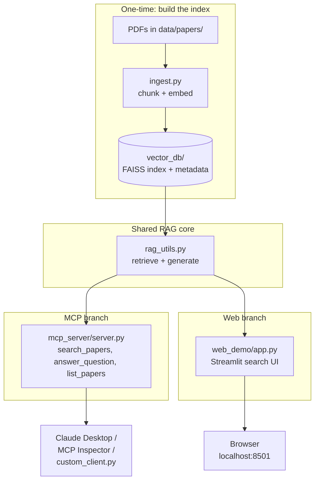

# RAG + MCP Research Paper Assistant

A retrieval-augmented generation (RAG) system built over 5 AI research papers, exposed
**two independent ways**:

- **MCP server** — tools callable by any MCP client (MCP Inspector, A custom python client, or a Claude Desktop), so an AI assistant can answer questions using this knowledge base. 
- **Streamlit web app** — a local browser UI for searching the same knowledge base directly.

Both interfaces share the exact same retrieval and generation logic underneath — nothing
is duplicated between them.

## Architecture



**Why two branches?** MCP is designed for AI clients (Claude Desktop, agents) to discover
and call tools. A regular web page can't easily "speak MCP," so the Streamlit app calls
`rag_utils.py` directly instead — same underlying logic, different calling convention.

## Folder structure
 
```
rag-mcp-papers/
├── data/papers/            # source PDFs 
├── vector_db/               # generated by ingest.py
├── ingest.py                  # builds the FAISS index from the PDFs
├── rag_utils.py                 # shared retrieval + generation logic
├── custom_client.py               # minimal standalone MCP client (proof of protocol)
├── mcp_server/
│   ├── server.py                    # MCP server exposing 4 tools
│   └── server.log                     # generated at runtime
├── web_demo/
│   └── app.py                         # Streamlit web UI
├── requirements.txt
├── .env.example
└── .gitignore
```

## Running it

**Option A — MCP Inspector**
```cmd
npx @modelcontextprotocol/inspector python mcp_server/server.py
```
Opens a browser UI to call `search_papers`, `answer_question`, and `list_papers` directly.

**Option B — Custom Python client (proves MCP is protocol-standard, not client-specific)**
```cmd
python custom_client.py
```

**Option C — Streamlit web app**
```cmd
streamlit run web_demo/app.py
```
Opens at `http://localhost:8501` with a search box for direct browser access.

## Known limitations

- PDF table extraction is naive (`pypdf` reads text linearly, so tables in the source papers
  lose their row/column structure when chunked). A production version would use a
  table-aware extractor (e.g. `unstructured`, `camelot`).
- FAISS uses `IndexFlatIP` (exact search) — fine at this scale (~150–200 chunks), but would
  need an approximate index (e.g. `IndexIVFFlat`) at much larger scale.
- `get_arxiv_metadata` depends on arXiv's public API being reachable and responsive; it can
  occasionally time out under load.